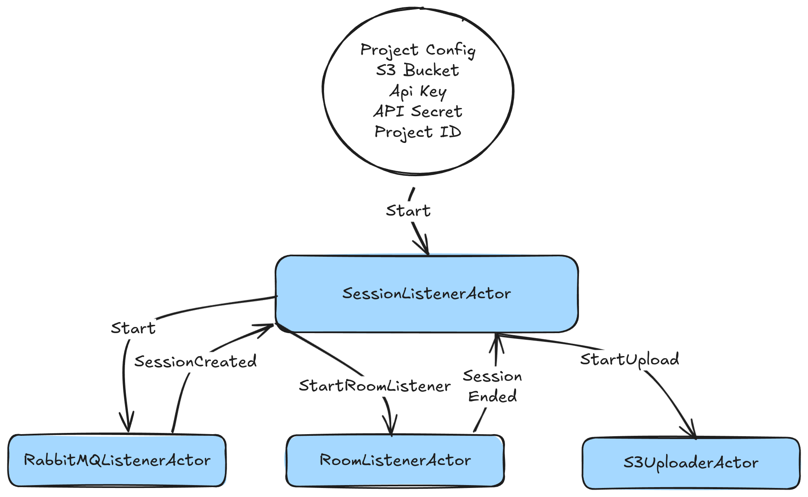

# Syncflow Text Egress Actor

The livekit egress servers handle the complex multimedia recording. However, text/data channel egress is not supported. This library attempts to implement an actix actor that can be used to extract text from the data channel and send it to a specified endpoint (S3). In SyncFlow integrations with the learning environments, we would need to do this because of textual data recordings.

## Architecture



1. The SessionListenerActor: This actor is responsible for initializing RabbitMQ connection to listen to new Session messages, this controls every thing from when new session messages are received to finalizing and uploading to S3. This sits as a controller for the project.

2. RabbitMQListenerActor: On new session for the project, this relays the session created message back to the SessionListenerActor.

2. Multiple RoomListenerActor(s): These actors are responsible for listening to the data channel of a specific room and saving the data to the temporary file system.

3. The S3UploaderActor: This actor is responsible for uploading the data to the specified S3 bucket.


## Use for your SyncFlow Project(s)
Navigate to your SyncFlow dashboard and generate the API keys for the projects you want to record the data channels for. Then, use the following structure in your a local `.env` file.

```{sh}
SYNCFLOW_SERVER_URL="BASE_URL_FOR_SYNCFLOW" 
RABBITMQ_HOST="SYNCFLOW RABBITMQ URL"
RABBITMQ_PORT="SYNCFLOW RABBITMQ PORT NUMBER"
RABBITMQ_VHOST_NAME="SYNCFLOW_VHOST_NAME"
DEVICE_GROUP_NAME="YOU WANT YOUR TEXT EGRESS KEY GROUP"

# Use project 0, 1, 2,... for multiple projects

PROJECTS__0__KEY="API KEY FOR THE PROJECT"
PROJECTS__0__SECRET="API SECRET FOR THE PROJECT"
PROJECTS__0__PROJECT_ID="PROJECT ID"
PROJECTS__0__S3_CONFIG__ACCESS_KEY="ACCESS KEY FOR YOUR S3 BUCKET"
PROJECTS__0__S3_CONFIG__SECRET_KEY="SECRET KEY FOR YOUR S3 BUCKET"
PROJECTS__0__S3_CONFIG__ENDPOINT="END POINT FOR YOUR S3 BUCKET"
PROJECTS__0__S3_CONFIG__BUCKET_NAME="BUCKET NAME FOR YOUR S3 BUCKET"
PROJECTS__0__S3_CONFIG__REGION="REGION FOR YOUR S3 BUCKET"
```

Then, start the project with

```sh
$ cargo run
```

## Funding info
This work is supported by the National Science Foundation under Grant No. DRL-2112635.
